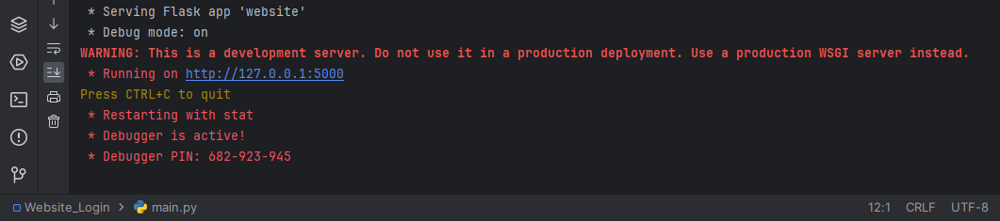

# Flask-Login
## A small, flask, web application that demonstrates the use of SQLite for creating, storing and retrieving user information.

The structure of this repository's files is similar to the structure the files would be in an IDE: 

Once the file structure has been set up and each file contains it's appropriate code we can run our application in DEBUG mode so that any changes made to the content of the files will be updated in real time on the web application. 

By default our web application will be run on the local server which we can paste into our browser and load the web application. Notice in the URL bar that we are running on the local host. 

