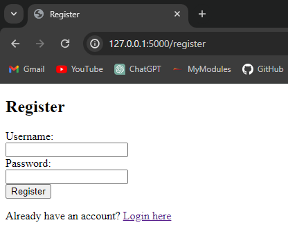
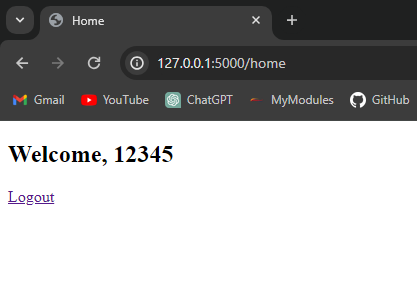
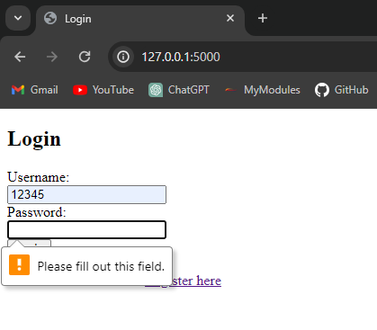
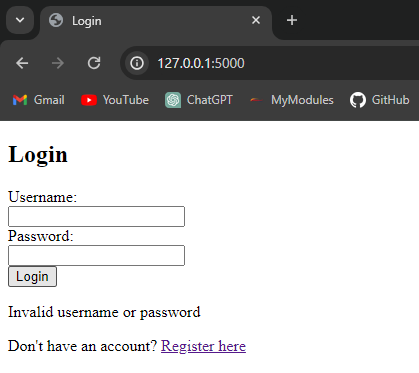
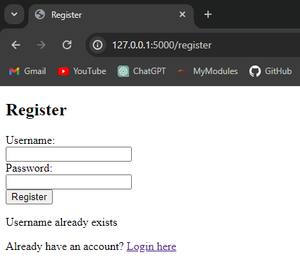

# Flask-Login
## A small, flask, web application that demonstrates the use of SQLite for creating, storing and retrieving user information.

The following demonstrates how error messages and form requirements make the web application user friendly and easy to understand 

